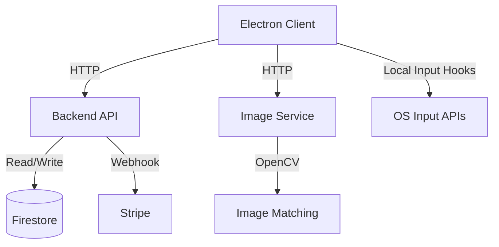

# Clicksmith

Overlay-first, human-in-the-loop input automation for safe, local workflows. The Electron client targets macOS first with Windows packaging, and the Overwolf overlay build is provided as a Windows-only option.

## MVP Highlights

- Record mouse + keyboard input with millisecond timing and contextual image patches.
- SmartClick replay with image matching fallback and retry policies.
- Takeover hotkey to annotate human corrections during playback.
- Save/Discard flow for profile deltas after each run.
- Profiles per target window with tags, import/export, and versioned metadata.
- Firebase + Stripe backend with opt-in cloud sync.

## Project Structure

- `client/`: Electron desktop client (React + TypeScript)
- `overwolf/`: Overwolf overlay client skeleton (Windows-only)
- `backend/`: Express API server (Firebase + Stripe)
- `image-service/`: Flask + OpenCV matching service
- `installer/`: NSIS installer assets
- `docs/`: Architecture, QA, investor, and compliance docs
- `samples/`: Example profiles and fixtures

## Safety & Compliance

Clicksmith does **not** inject into other processes or read game memory. It uses OS-level input APIs only. Do not use Clicksmith in any online or competitive service that prohibits automation. Users are responsible for complying with target app terms.

## Mods (Optional)

Clicksmith can surface external game mods via a registry, but mods run inside the game process and must be installed separately. See `docs/mods/manifest.md` and `docs/mods/protocol.md` for the adapter format and protocol.

## Local Development

### Prerequisites
- Node.js >= 18
- Python >= 3.9
- Docker (optional, for image service)
- NSIS (for Windows installer)

### Install
```bash
npm install
cd client && npm install
cd ../backend && npm install
cd ../image-service && pip install -r requirements.txt
```

### Run
```bash
npm run dev
```

Or individually:
- Client: `cd client && npm run dev`
- Backend: `cd backend && npm run dev`
- Image Service: `cd image-service && python app/main.py`

### Build + Package
```bash
cd client && npm run build && npm run package
cd ../backend && npm run build
makensis installer/clicksmith.nsi
```

### Testing
```bash
npm test
```

## Architecture



## EULA

The installer and first-run modal require acceptance of a Clicksmith EULA, including the restriction on online competitive use.

## License

MIT License. See `LICENSE.txt`.
